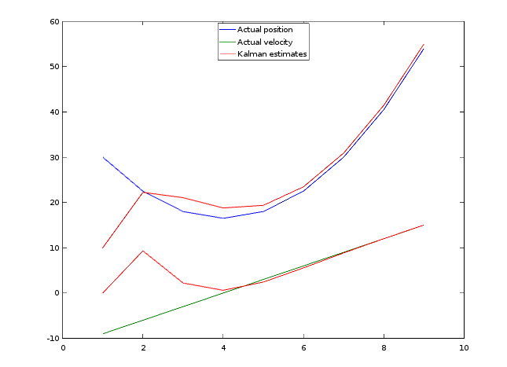

Sparkstr
========

This project is composed of examples of [Spark
Streaming](http://spark.incubator.apache.org/docs/latest/index.html) jobs.
These are proofs of concepts about Spark Streaming; none of the algorithms are
new, nor is anything ready for production.

A Spark Streaming job can be created in a [dozen
lines](http://docs.sigmoidanalytics.com/index.php/Running_A_Simple_Streaming_Job_in_Local_Machine),
and some of these jobs in this project are nearly as simple.

Installation
------------

This assumes some knowledge of Java and Scala.  The code was developed on Linux
with Java 7.

Install [sbt](http://www.scala-sbt.org/) and [Spark](https://spark.apache.org/).
The versions are given in the `libraryDependencies` variable in the `build.sbt`
file.

Clone this repository using a url on the right and run `sbt` in the sparkstr
directory.  At the sbt prompt, run `compile` and then one of the `run-main`
commands below.

Stream Summer
-------------

This very simple job takes a stream of key-value pairs `(String, Double)` and
accumulates the sum of the values per key.

Run this in sbt with

    > run-main sparkstr.StreamSummer local[2] 1

Largest and Smallest Values in a Stream
---------------------------------------

Find the current *k* largest and *j* smallest values in a stream.

Run this in sbt with

    > run-main sparkstr.StreamLargest local[2] 1

Stream Average
--------------

This job takes a stream of key-value pairs `(String, Double)` and gives the
average (or mean) per key.

Run this in sbt with

    > run-main sparkstr.StreamAverager local[2] 1

Stream Variance
---------------

This job finds the variance (or, if desired, the standard deviation) over time
for all the values for each key.  It calculates the running average (mean) along
the way in the same straight-forward way as the Stream Average job.  

Run this in sbt with

    > run-main sparkstr.StreamVariance local[2] 1

There are several ways to compute the variance of a stream of numbers; see the
Wikipedia article [Algorithms for calculating
variance](http://en.wikipedia.org/wiki/Algorithms_for_calculating_variance).

Mean and variance are based on calculations known as *central moments*.  Mean
and variance are based on the second and third of the typical five central
moments (the first is defined to be 1).  The fourth and fifth statistics based
on central moments are kurtosis and skewness, which can be calculated in a
streaming (or "online") way, as well.  The online algorithms for the third and
fourth central moments are given in the Wikipedia article linked above.  A Scala
implementation of the algorithms is found in Twitter's
[algebird](https://github.com/twitter/algebird/) project; in particular see
com.twitter.algebird.Moments.

Algorithms such as the "Welford" algorithm iteratively update the variance as
new data arrives, one value at a time.  It is also possible to combine variances
from sets of values.  Depending on the use case, values may arrive one per Spark
Streaming batch duration, or several values may arrive in that batch.  The first
case is more like a digital signal processing or real-time situation, and in
this case the implementation of the Welford algorithm need not have a loop---the
looping structure would be provided by Spark Streaming. The second case would
find the variance of the new values and then combine the result into the
previous variance.  The implementation here is that of the second case: multiple
values are processed in each batch duration and the resulting variance is
combined with the previous variance.

Yet another consideration is that some formulas for variance are more
numerically stable than others; in particular the Welford algorithm is known to
be better in this regard than summing the squares of the values and subtracting
the square of the mean.

I rolled my own combining formula here, but note that the variance
implementation seems to be done well (i.e., with attention paid to
floating-point issues) in Spark's built-in
[StatCounter](https://github.com/apache/spark/blob/master/core/src/main/scala/org/apache/spark/util/StatCounter.scala).
I recommend using that for variance.  The other moments can be calculated with
the algebird library.

HyperLogLog Implementation
--------------------------

This is an implementation of the HyperLogLog algorithm by [Flajolet
et.al](http://citeseerx.ist.psu.edu/viewdoc/summary?doi=10.1.1.142.9475). The
algorithm uses probabilistic techniques to estimate the size of data.  A good
discussion is at the [AK Tech
Blog](http://blog.aggregateknowledge.com/2012/10/25/sketch-of-the-day-hyperloglog-cornerstone-of-a-big-data-infrastructure/),
which also sports a visualization tool.

Run this in sbt with

    > run-main sparkstr.HyperLogLog local[2] 1

The defaults are to create a single set with a million members.  It might be
worthwhile to use `local[4]` instead of `local[2]` if you have the available
cores.

HyperLogLog is sometimes called a *cardinality estimator*.  Note that
"cardinality" is used to mean "set size" in the strict sense of set---no
repeated (duplicate) values.  It could be called a *number of distinct values
estimator*.  

Stream Histogram and Estimated Median
-------------------------------------

This job maintains a histogram of incoming values and an estimate of their
median.

Run this in sbt with

    > run-main sparkstr.StreamHistogramMedian local[2] 1

The histogram is formed by dividing an interval into subintervals and keeping
count of the number of incoming values within each subinterval.  For example,
the interval [0, 100] can be divided into twenty subintervals with endpoints 0,
5, 10, 15, etc.  If the values 6.5, 6.4, and 6.3 arrive, the count for the
interval [5, 10) is incremented by three.  

The median is determined to be in a certain subinterval of the histogram.  Since
the original values that built the histogram are not retained, we estimate the
value of the median to be the average of the endpoints of that subinterval.  In
the example above, if the actual median is in [5, 10), then the estimated median
is 7.5.

Spark Streaming Kalman Filter
-----------------------------

This job implements a basic two-dimensional Kalman filter.  The example here is
motivated by the example application in the [Wikipedia
article](http://en.wikipedia.org/wiki/Kalman_filter).  In the example, position
and velocity under a constant acceleration in one dimension are tracked.

Run this in sbt with

    > run-main sparkstr.KalmanFilter local[2] 1

Given a sequence over time of measurements of position and velocity, the Kalman
filter will continuously predict the next position and velocity in the
iteration.  In this job, the Kalman iteration prediction and update steps are
one-to-one with the Spark Streaming iterations.  The noisy input position and
velocity data (i.e., "observations" or "measurements") are generated from a
known *transition model*.  In a sense, the transition model provides us with the
Platonic truth about the system state; in this example, physics gives us the
transition model.  In real-life applications, we don't have the actual true
position and velocity and the Kalman filter compensates by acknowledging noise
in the system.  Of course, in some applications (not this one), where no a
priori physical model is available at all, the transition model is inferred from
the data.  In this example we use the known transition model both for generating
noisy measurement data and making successive estimates from the measurements.

Kalman filters are extensively studied.  This example does not consider square
root, ensemble, or unscented Kalman filters, all of which are important
extensions.

In the figure below we see the Kalman estimates converging to the actual values.
The plots were generated with [Octave](https://www.gnu.org/software/octave/).

### About the Code

Following the Wikipedia notation, the 2x1 matrix data are labeled as follows.

 * `x` The true "Platonic" position and velocity.
 * `z` The observed position and velocity.
 * `xe` The estimated or predicted position and velocity.

The matrix computations are accomplished with [Breeze Linear
Algebra](https://github.com/scalanlp/breeze/wiki/Breeze-Linear-Algebra).  I am
grateful to a Kalman filter expert, [Steve
Thomas](http://www.linkedin.com/pub/steve-thomas/5/317/b2), for his help.
